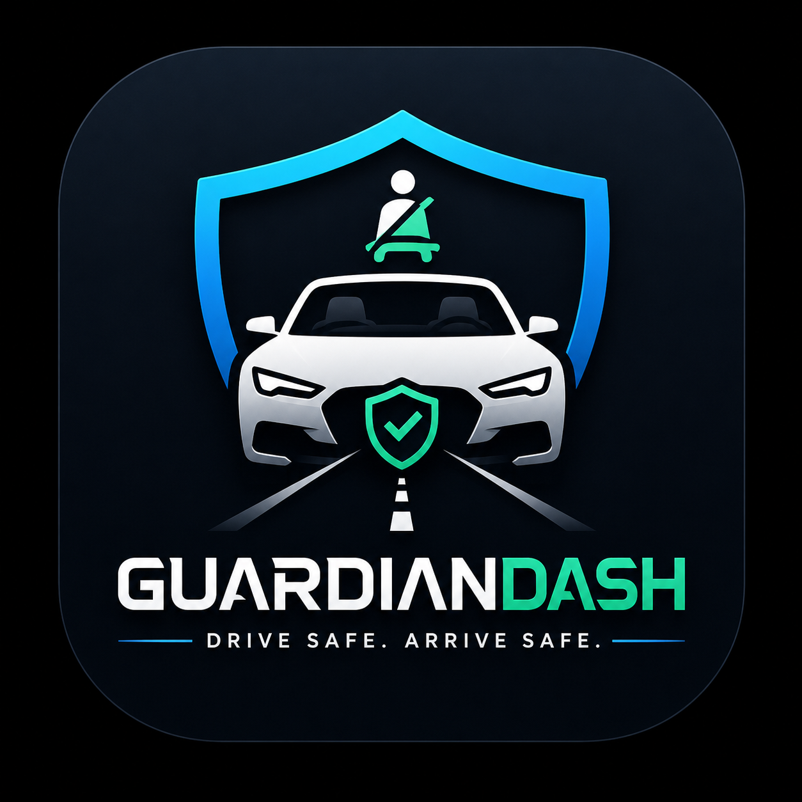
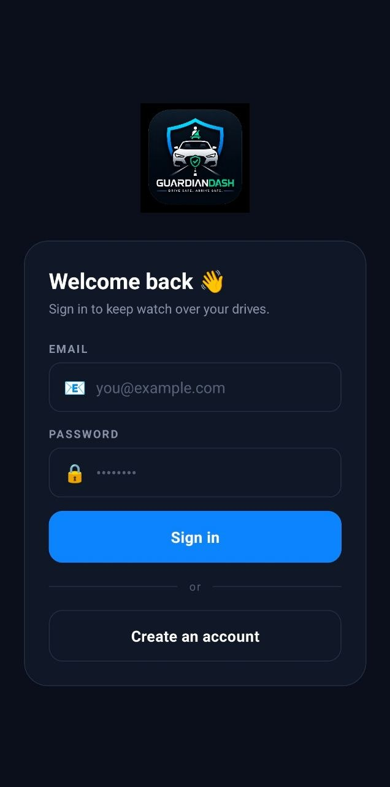
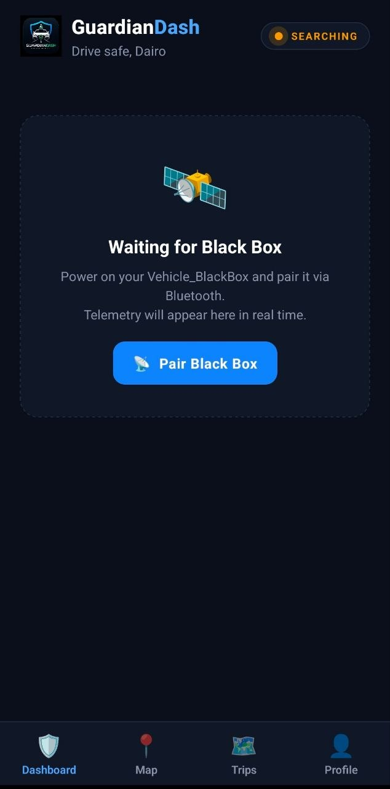
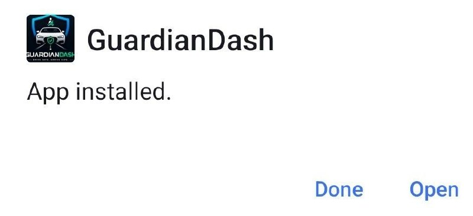
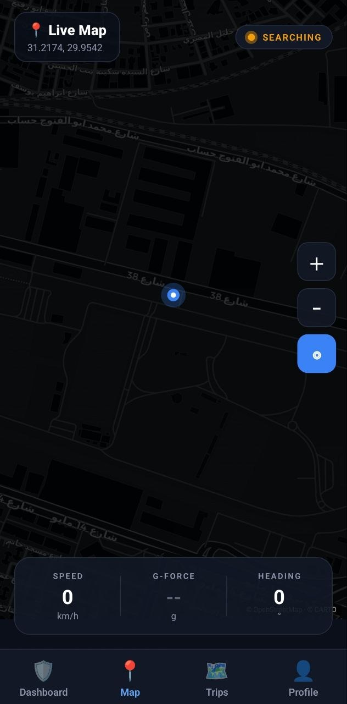

<p align="center">
  
</p>

<h1 align="center">🛡️ GuardianDash — Your Vehicle's Black Box & Guardian Angel</h1>

<p align="center">
  🚗 Crash Detection • 📡 Real-Time Telemetry • 🚨 Auto Emergency Call • 📱 Native Android App
  <br/>
  🎓 <em>Final Project — Embedded Systems Course</em>
</p>

<p align="center">
  📥 <a href="https://expo.dev/accounts/dairo8/projects/guardiandash/builds/d28c9c50-79b6-4520-8274-de7a3aaa72da"><strong>Install the latest APK</strong></a>
  &nbsp;·&nbsp;
  📑 <a href="docs/report.pdf"><strong>Project Report (PDF)</strong></a> <em>· coming soon</em>
</p>

---

## 🧠 Overview

**GuardianDash** is a smart vehicle **black box** that watches over you on every drive.

A small device inside your car continuously reads **G-force** from an MPU6050 accelerometer. The moment it detects a collision, it shows `STATUS: UNSAFE` on its own LCD, streams the spike to your phone over Bluetooth, and **calls your emergency contacts** — all in seconds.

Drive with peace of mind. **GuardianDash has your back.** 💪

---

## ✨ Key Features

### 📱 The Mobile App
- 🎛 **Live dashboard** — real-time G-force gauge with LCD-style mirror of the on-board display
- 🚨 **Full-screen crash alert** with 30-second auto-call countdown
- 🗺 **Trip history & replay** — every drive, mapped and chartable
- 📞 **Emergency contacts** — up to 5 people, prioritized for rapid call-out
- ⚙️ **Adjustable crash sensitivity** (Low / Medium / High)
- 📡 **Bluetooth pairing** with the hardware over BLE
- 🌗 **Dark, modern UI** built for clarity in any light

### 🚨 Crash Detection & eCall
- 💥 **G-force threshold** triggers the crash event automatically
- 📲 Full-screen red alert + 30-second cancel window
- 📞 **Auto-calls emergency contact #1** if not cancelled
- 💬 Sends an SMS with location + severity in parallel
- 📍 GPS coordinates attached to the alert

### 🔌 Hardware Black Box
- **STM32F401** microcontroller running custom firmware
- **MPU6050** IMU over I²C — reads accel X/Y/Z at ±2g range
- **16×2 I²C LCD** showing live `G:1.23` + `STATUS: SAFE / UNSAFE`
- **HM-10 BLE module** streams telemetry to the phone wirelessly
- Powered by a USB power bank — fully sealed in the car

---

## 🎬 Demo

> ▶️ [**Watch the demo video**](assets/demo.mp4) <em>· coming soon</em>

---

## 🖼 Screenshots

<p align="center">
  
  &nbsp;
  
  &nbsp;
  
</p>

<p align="center">
  <em>Login · Dashboard (unpaired) · Real APK installed</em>
</p>

<p align="center">
  
  &nbsp;
  
  &nbsp;
  
</p>

<p align="center">
  <em>Dashboard (paired) · Crash alert · Live map</em>
  <br/>
  <em>📸 More screenshots coming soon</em>
</p>

---

## 🦾 The Hardware

<p align="center">
  
</p>

<p align="center">
  <em>STM32F401 + MPU6050 + I²C LCD + HM-10 — sealed inside the box</em>
  <br/>
  <em>📸 Final enclosure photo coming soon</em>
</p>

---

## 🏗 System Architecture

```
   [🔋 Power bank]
         │ 5V
         ▼
   ┌────────────────────────────┐         📶  Bluetooth (HM-10)
   │  🚗 Vehicle_BlackBox       │  ─────────────────────┐
   │  STM32F401 firmware        │                       ▼
   │  • MPU6050 @ I²C 0x68      │              ┌──────────────┐
   │  • G = √(Ax² + Ay² + Az²)  │              │  📱 Phone    │
   │  • 16×2 LCD readout         │              │  GuardianDash │
   │  • UART → HM-10 BT          │              └──────┬───────┘
   └────────────────────────────┘                      │ HTTPS
                                                       ▼
                                          ┌──────────────────────────┐
                                          │  ☁️  GuardianDash API    │
                                          │  Node + Express + SQLite │
                                          │  hosted on Render.com    │
                                          └──────────────────────────┘
```

Three independent components that don't need each other to function:
- **Hardware** — STM32 + sensor + LCD inside the car, powered by a power bank
- **Mobile app** — standalone Android APK, talks to the cloud over HTTPS and (when paired) to the black-box over Bluetooth
- **Cloud backend** — persists accounts, contacts, trips, stats; auto-deploys from GitHub via Render

---

## 📂 Repository Structure

```
GuardianDash/
├── app/         # 📱 React Native + Expo + TypeScript mobile app
├── backend/     # ☁️  Node + Express + SQLite API (Render-deployable)
├── hardware/    # 🔌 STM32F401 firmware (Vehicle_BlackBox)
└── assets/      # 🎨 Logo and screenshots
```

---

## 🛠 Tech Stack

| Layer | Tools |
|---|---|
| **Mobile App** | React Native, Expo, TypeScript, Expo Router, Reanimated |
| **State** | Zustand |
| **Maps** | OpenStreetMap tiles + react-native-svg |
| **Bluetooth** | react-native-ble-plx (HM-10 BLE) |
| **Backend** | Node.js, Express, SQLite, JWT |
| **Hosting** | Render.com (free tier) |
| **Hardware** | STM32F401, MPU6050 IMU, 16×2 I²C LCD, HM-10 BLE |
| **Firmware** | C + STM32 HAL · I²C1 @ 100 kHz · USART2 @ 9600 baud (to HM-10) |

---

## 👥 Team Members

- **[@Mohamed Abdallah Eldairouty](https://github.com/MohamedEldairouty)** – 221001719
- **[@Rimas Emad](https://github.com/rimas1470-collab)** – 221001067
- **[@Judy Yehia](https://github.com/Judyehia)** – 221000495
- **Moaz Ali** – 221001970

---

## 🎓 Academic Context

Final Project for the **Embedded Systems Course**. Demonstrates:
- 📡 Real-time sensor acquisition over I²C
- 🚨 Event-driven embedded logic (crash detection)
- 📶 Wireless data transport over BLE
- 📱 Cross-platform mobile development
- ☁️ Cloud backend deployment
- 🧱 End-to-end system design — sensor to phone to cloud

---

<p align="center">
  🛡️ <strong>GuardianDash</strong> — Smart Driving. Safer Lives.
</p>
